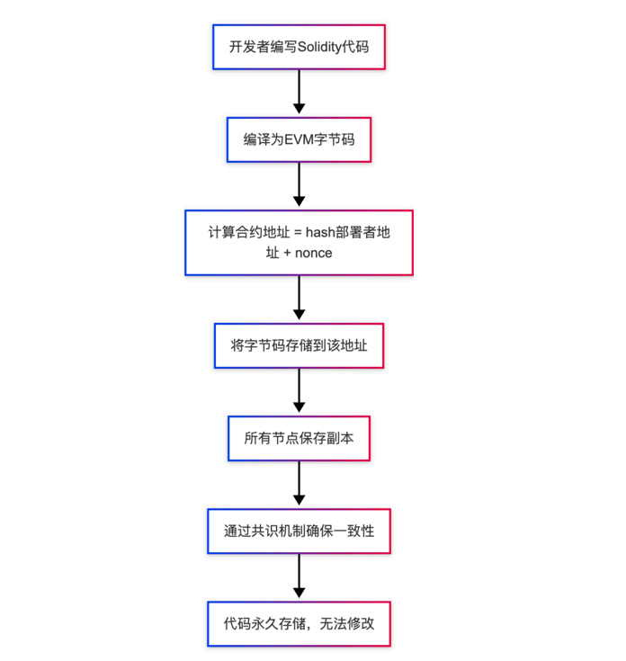
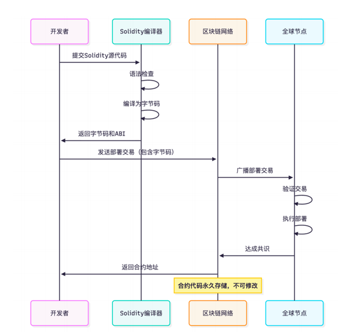
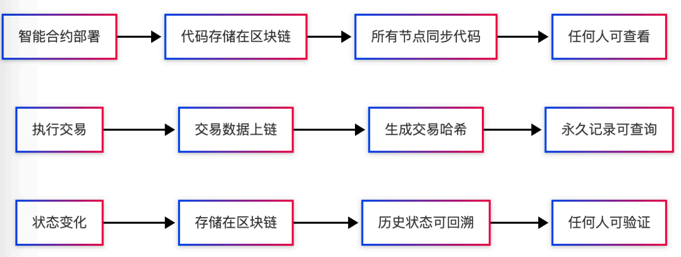
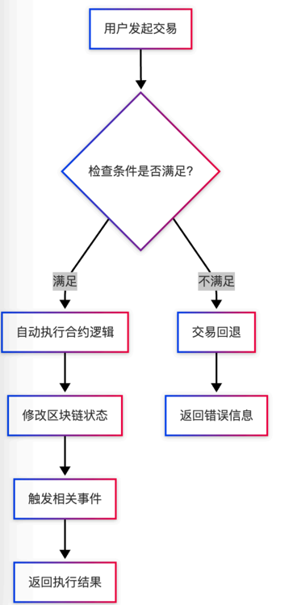
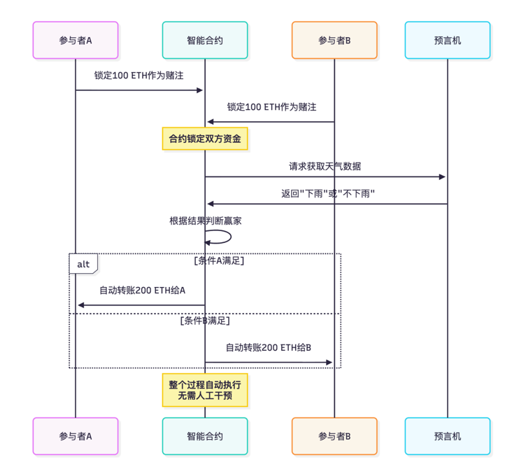
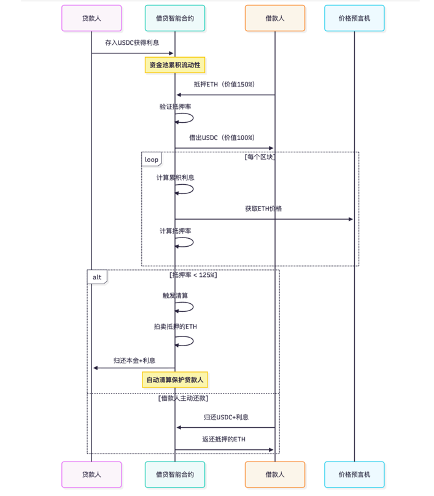
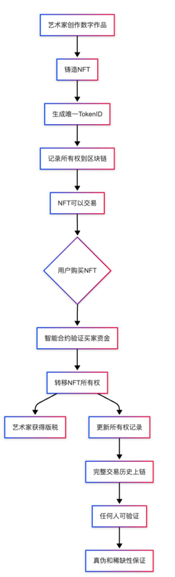
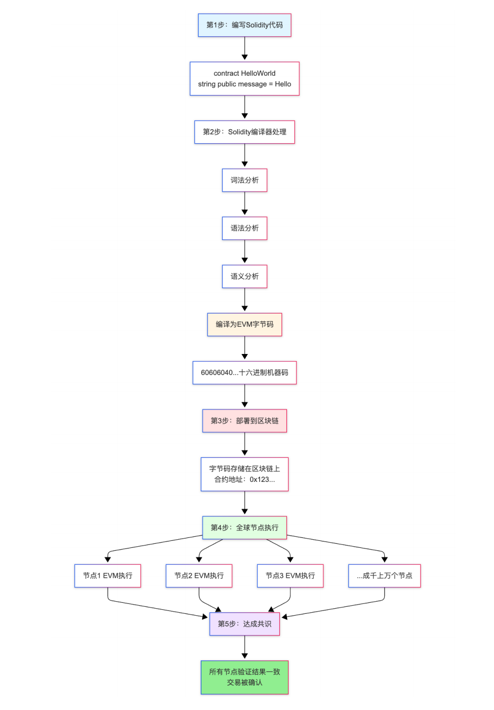
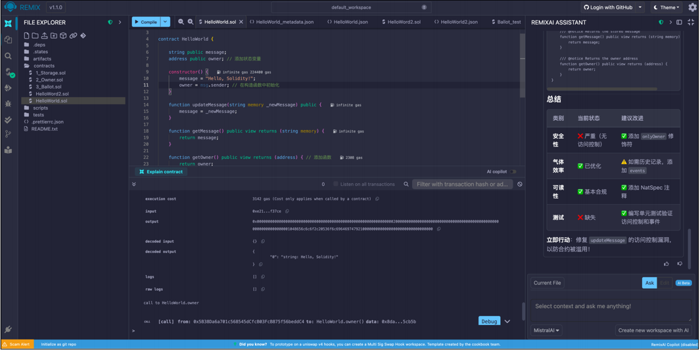

# Solidity智能合约开发知识 
## 第1.1课：智能合约基础与环境搭建

**学习目标**：理解智能合约的基本概念、掌握以太坊虚拟机EVM的工作原理、学会使用Remix IDE开发环境、完成第一个智能合约的部署

**预计学习时间**：1-2小时

**难度等级**：入门

---

## 目录

1. [智能合约基础概念](#1-智能合约基础概念)
2. [以太坊虚拟机EVM](#2-以太坊虚拟机evm)
3. [开发环境Remix IDE](#3-开发环境remix-ide)
4. [第一个智能合约](#4-第一个智能合约)
5. [编译和部署](#5-编译和部署)
6. [合约交互](#6-合约交互)

---

## 1. 智能合约基础概念

### 1.1 什么是智能合约

智能合约（Smart Contract）是运行在区块链上的程序代码，它是区块链技术最核心的创新之一。智能合约的概念最早由密码学家Nick Szabo在1994年提出，但直到以太坊的出现才得以真正实现。

**智能合约的本质**：

智能合约本质上是一段存储在区块链上的代码，这段代码定义了一系列规则和条件。当满足预设条件时，合约会自动执行相应的操作，整个过程完全自动化，不需要任何人工干预或第三方介入。

可以把智能合约理解为一个数字化的"自动售货机"：
- 传统售货机：投币→选择商品→自动出货
- 智能合约：满足条件→自动执行→产生结果

但智能合约比售货机强大得多，它可以处理复杂的金融交易、资产转移、权益分配等各种操作。

**智能合约与传统程序的对比**：

| 特性 | 传统程序 | 智能合约 |
|------|---------|---------|
| 运行环境 | 服务器/电脑 | 区块链网络 |
| 数据存储 | 数据库 | 区块链 |
| 执行控制 | 开发者/管理员 | 代码自动执行 |
| 修改能力 | 可以随时修改 | 部署后不可修改 |
| 信任模式 | 信任运营方 | 信任代码和算法 |
| 透明度 | 通常不透明 | 完全透明 |
| 单点故障 | 存在 | 去中心化，无单点故障 |

**智能合约的核心特征**：

**不可篡改性**：

智能合约一旦部署到区块链上，其代码就永久固化，任何人都无法修改，包括合约的创建者。这是通过区块链的密码学机制实现的。

工作原理：


这种不可篡改性带来的优势：

- **确定性**：合约行为完全确定，不会被暗中修改
- **可信性**：用户可以信任代码逻辑，而不需要信任运营方
- **可审计性**：任何人都可以审查合约代码，确保其符合预期

这种不可篡改性也带来挑战：
- **无法修复bug**：一旦发现漏洞，无法直接修复
- **功能固化**：无法根据需求变化升级功能
- **需要升级机制**：需要在设计时考虑可升级性（如代理模式）

部署流程详解：




**公开透明性**：
所有的智能合约代码和执行结果都存储在公开的区块链上。任何人都可以查看合约的源代码（如果开发者选择公开）、查看每一笔交易的详细信息、验证合约的执行结果。

透明性体现在：
- 合约代码公开可查
- 所有交易记录可追溯
- 执行结果可验证
- 状态变化完全透明

透明性的技术实现：



透明性的实际应用：

- **审计追踪**：监管机构可以实时监控资金流向
- **公开验证**：用户可以验证合约是否按承诺执行
- **信任建立**：透明的代码和执行消除信息不对称
- **争议解决**：链上记录可作为不可篡改的证据

**自动执行性**：

智能合约按照预先编写的逻辑自动执行，不需要中介机构或第三方介入。一旦触发条件满足，合约会自动运行，结果确定且无法被阻止。

自动执行的工作流程：




执行特点详解：

- **条件触发即执行**：无需等待人工批准或处理
- **无需人工干预**：全程自动化，降低人为错误风险
- **无法中途停止**：一旦开始执行就必须完成或失败
- **结果确定性**：相同输入必然产生相同输出

自动执行的优势：
1. **效率提升**：交易即时处理，无需等待人工操作
2. **成本降低**：消除中介费用，只需支付gas费
3. **准确性高**：代码逻辑精确，无人为判断偏差
4. **24/7运行**：全天候自动执行，不受工作时间限制

自动执行的应用案例：
- **自动分红**：定期自动向代币持有者分配收益
- **自动清算**：DeFi借贷中，抵押物价值下跌时自动清算
- **自动履约**：保险合约中，满足赔付条件时自动理赔
- **自动投票**：DAO治理中，自动统计投票并执行决议

### 1.2 智能合约的实际应用案例

**案例1：去中心化打赌系统**

传统打赌方式存在的问题：

传统打赌依赖信任机制，参与者A和参与者B之间需要相互信任，或者依赖第三方托管。这种模式存在多个问题：
- 信任风险：一方可能赖账不履约
- 中介风险：第三方可能卷款跑路或不公正
- 效率低下：需要人工确认和转账
- 成本高昂：第三方托管收取手续费
- 争议解决困难：缺乏客观证据

智能合约解决方案：

通过智能合约，可以实现完全去信任的打赌系统：



智能合约实现的优势：

1. **去信任化**：不需要信任对方，只需信任代码
2. **资金安全**：双方资金由合约托管，无法单方面撤回
3. **结果客观**：通过预言机获取可信数据源
4. **自动结算**：满足条件立即转账，无需人工操作
5. **完全透明**：所有逻辑和执行过程公开可查
6. **无法赖账**：合约强制执行，赢家必然获得资金

**案例2：去中心化金融（DeFi）借贷协议**

传统金融借贷的局限性：

传统金融借贷需要通过银行或金融机构进行，存在诸多限制：
- **准入门槛高**：需要信用记录、收入证明等复杂材料
- **审批流程长**：可能需要数天甚至数周
- **成本高昂**：中介费用、管理费用层层叠加
- **中心化风险**：完全依赖金融机构的信用
- **时间限制**：受工作时间限制，无法24小时服务
- **地域限制**：跨境借贷困难且成本高

智能合约借贷（以Compound为例）：

DeFi借贷协议通过智能合约实现完全去中心化的借贷服务：



DeFi借贷的工作机制：

1. **流动性提供**：
   - 贷款人将资金存入智能合约
   - 自动生成cToken（如cUSDC）代表份额
   - 随时可以赎回本金和利息

2. **超额抵押借贷**：
   - 借款人抵押价值150%的资产（如ETH）
   - 可以借出价值100%的稳定币（如USDC）
   - 抵押率保证资金安全

3. **自动利率调整**：
   - 利率由供需关系决定
   - 使用率越高，利率越高
   - 每个区块自动更新利率

4. **自动清算机制**：
   - 实时监控抵押率
   - 抵押率低于阈值触发清算
   - 清算人可以获得清算奖励

DeFi借贷的技术优势：
- **无需许可**：任何人都可以参与，无需KYC
- **即时借贷**：几秒钟内完成，无需审批
- **透明规则**：所有规则代码化，公开可查
- **全球访问**：任何地方都可以使用
- **低成本**：只需支付gas费，无中介费用
- **自动化**：利息计算、清算全自动
- **可组合性**：可以与其他DeFi协议组合使用

**案例3：NFT数字艺术品与所有权证明**

传统数字资产的问题：

数字内容（图片、音乐、视频等）可以无限复制，这导致：
- 所有权难以证明
- 原创者权益难以保护
- 稀缺性无法保证
- 真伪难以鉴别
- 交易历史不可追溯

智能合约解决方案（ERC-721 NFT标准）：

通过NFT智能合约，每个数字资产都有唯一的、不可复制的所有权证明：




NFT智能合约的核心功能：

1. **唯一标识**：
   - 每个NFT有唯一的TokenID
   - 即使相同的图片，TokenID也不同
   - 通过区块链确保唯一性

2. **所有权记录**：
   - 当前所有者地址记录在链上
   - 所有权转移历史完整保存
   - 任何人都可以验证真实所有者

3. **版税机制**：
   - 可以设置创作者版税比例
   - 每次二级市场交易自动分配版税
   - 保护创作者长期收益

4. **元数据存储**：
   - NFT关联的图片、描述等元数据
   - 通常存储在IPFS等去中心化存储
   - 确保内容永久可访问

NFT应用场景：
- **数字艺术品**：独特的数字绘画、音乐、视频作品
- **游戏道具**：游戏中的装备、角色、土地
- **虚拟房地产**：元宇宙中的地产
- **会员资格**：社区会员、俱乐部通行证
- **票务系统**：演唱会门票、活动入场券
- **身份证明**：学历证书、技能认证
- **收藏品**：数字收藏卡、纪念品

### 1.3 为什么学习Solidity

Solidity是以太坊智能合约的主流开发语言。学习Solidity可以让你：

**职业发展**：
- 智能合约开发工程师（高薪岗位）
- 区块链安全审计员
- DApp全栈开发者
- Web3创业者

**技术能力**：
- 理解区块链底层原理
- 掌握去中心化应用开发
- 学习新的编程范式
- 提升系统架构能力

**市场机会**：
- Web3行业快速发展
- 大量项目需要智能合约开发
- 开源项目贡献机会
- 创新应用场景

---

## 2. 以太坊虚拟机EVM

### 2.1 EVM的基本概念

以太坊虚拟机（Ethereum Virtual Machine，简称EVM）是执行智能合约的运行环境。可以把EVM想象成一台全球共享的计算机，所有以太坊节点都运行这台虚拟机。

**EVM的特点**：

**确定性执行**：
给定相同的输入和状态，EVM总是产生相同的输出。这确保了所有节点执行合约时都能得到一致的结果。

**隔离性**：
每个合约在EVM中独立运行，相互隔离，一个合约的错误不会影响其他合约或整个系统。

**完整性**：
EVM是图灵完备的，理论上可以执行任何计算任务。但由于Gas限制，实际上会限制计算复杂度。

### 2.2 从Solidity到EVM执行

智能合约的执行过程：


```
第1步：编写Solidity代码
    ↓
contract HelloWorld {
    string public message = "Hello";
}
    ↓
第2步：Solidity编译器处理
    ↓
编译为EVM字节码（Bytecode）
    ↓
60606040...（十六进制机器码）
    ↓
第3步：部署到区块链
    ↓
字节码存储在区块链上
    ↓
第4步：全球节点执行
    ↓
每个以太坊节点的EVM执行相同的代码
    ↓
第5步：达成共识
    ↓
所有节点验证结果一致
```

### 2.3 Gas机制详解

Gas是以太坊网络的计费单位，用于衡量执行智能合约所需的计算资源。

**为什么需要Gas**：

防止滥用资源：
如果执行代码不需要付费，恶意用户可能编写无限循环的代码，占用网络资源。Gas机制确保每一步计算都有成本，防止资源滥用。

激励矿工：
矿工/验证者执行交易需要计算资源（CPU、存储等），Gas费用作为他们的报酬。

优先级排序：
愿意支付更高Gas价格的交易会被优先处理，实现市场化的资源分配。

**Gas计算方式**：

```
交易总费用 = Gas使用量 × Gas价格

例如：
Gas使用量：21,000（简单转账）
Gas价格：50 Gwei（1 Gwei = 10^-9 ETH）
总费用：21,000 × 50 × 10^-9 = 0.00105 ETH

如果ETH价格是$2000：
总费用 = $2.1
```

**不同操作的Gas成本**：

```
基本操作：
加法运算：3 gas
乘法运算：5 gas

存储操作：
读取storage：200 gas
写入storage（新值）：20,000 gas
写入storage（修改）：5,000 gas

内存操作：
读写memory：3 gas

其他操作：
创建合约：32,000 gas起
发送ETH：21,000 gas（基础转账）
```

从上面可以看出，存储操作是最昂贵的，这就是为什么我们需要优化storage的使用。

### 2.4 Gas优化的重要性

**实际成本计算**：

假设一个函数需要写入5个storage变量：
```
Gas消耗：5 × 20,000 = 100,000 gas

成本计算（假设）：
Gas价格：100 Gwei
ETH价格：$3000

费用 = 100,000 × 100 × 10^-9 × 3000
    = $30
```

一次简单的操作就需要30美元！这就是为什么Gas优化在智能合约开发中如此重要。

优化的意义：
- 降低用户使用成本
- 提升用户体验
- 增加合约竞争力
- 减少资源浪费

---

## 3. 开发环境Remix IDE

### 3.1 为什么选择Remix

Remix IDE是以太坊官方推荐的在线集成开发环境，特别适合初学者和快速原型开发。

**Remix的优势**：

无需安装配置：
- 打开浏览器即可使用
- 不需要安装Node.js等依赖
- 不需要配置复杂的开发环境
- 跨平台（Windows、Mac、Linux）

功能完整：
- 代码编辑器（支持语法高亮）
- Solidity编译器（多版本支持）
- 部署工具（支持多种网络）
- 调试器（断点、变量查看）
- 测试框架（单元测试）
- 插件系统（扩展功能）

官方维护：
- 以太坊基金会官方项目
- 及时更新支持新版本Solidity
- 稳定可靠
- 丰富的文档和教程

学习友好：
- 界面直观
- 即时反馈
- 自带示例合约
- 适合教学演示

### 3.2 Remix界面详解

访问地址：https://remix.ethereum.org

**界面布局结构图**：

Remix IDE界面布局（从上到下，从左到右）：


**左侧文件管理区详解**：

文件浏览器（File Explorer）功能：
- **目录结构管理**：
  - contracts/：存放.sol智能合约源文件
  - scripts/：存放JavaScript部署脚本
  - tests/：存放Solidity测试文件
  - artifacts/：编译产物（自动生成）
  - .deps/：外部依赖库
  - .states/：工作区状态文件

- **文件操作**：
  - New File：创建新文件（支持.sol, .js, .md等）
  - New Folder：创建新文件夹
  - Upload：从本地上传文件
  - Download：下载文件到本地
  - Rename：重命名文件或文件夹
  - Delete：删除文件

- **工作区管理**：
  - 支持多工作区切换
  - 可以克隆GitHub仓库
  - 支持Git版本控制
  - 工作区状态自动保存

**中间代码编辑区详解**：

代码编辑器功能：
- **语法高亮**：Solidity关键字、函数、变量等不同颜色显示
- **智能提示**：输入时自动提示函数名、变量名
- **错误提示**：实时显示语法错误，红色波浪线标注
- **代码补全**：Tab键自动补全代码
- **括号匹配**：自动匹配括号、大括号
- **代码折叠**：可以折叠函数、合约块
- **多文件支持**：标签页切换多个文件
- **Gas估算**：函数旁显示预估Gas消耗

编辑器快捷键：
- Ctrl/Cmd + S：保存文件
- Ctrl/Cmd + F：查找
- Ctrl/Cmd + H：替换
- Ctrl/Cmd + /：注释/取消注释
- Ctrl/Cmd + Z：撤销
- Ctrl/Cmd + Shift + Z：重做

**右侧功能面板详解**：

功能面板包含多个插件，每个插件对应不同功能：

1. **Solidity Compiler（编译器）**：
   - 选择编译器版本
   - 自动编译选项
   - 优化设置
   - 查看编译结果
   - ABI和字节码导出

2. **Deploy & Run Transactions（部署）**：
   - 选择部署环境（Remix VM/Injected Provider/Web3 Provider）
   - 管理账户和余额
   - 设置Gas limit和Value
   - 部署合约
   - 与已部署合约交互

3. **Solidity Unit Testing（测试）**：
   - 创建测试文件
   - 运行测试用例
   - 查看测试结果
   - 测试覆盖率分析

4. **Debugger（调试器）**：
   - 断点调试
   - 单步执行
   - 变量查看
   - 调用栈分析

5. **Solidity Static Analysis（静态分析）**：
   - 代码质量检查
   - 安全漏洞扫描
   - 最佳实践建议

**底部控制台详解**：

控制台显示信息：
- **编译信息**：编译成功/失败消息
- **交易日志**：每笔交易的详细信息
- **调试输出**：console.log输出（如果使用）
- **错误警告**：编译错误、运行时错误

交易日志详细信息：
```
[vm] from: 0x5B3...eddC4
[vm] to: HelloWorld.updateMessage(string) 0xd91...39138  
[vm] value: 0 wei
[vm] data: 0xa4c...
[vm] logs: 0
[vm] hash: 0x3b5...
status: true Transaction mined and execution succeed
transaction cost: 43494 gas
execution cost: 22230 gas
decoded input: { "string _newMessage": "I love blockchain!" }
decoded output: {}
```

### 3.3 Remix基本操作

**创建新文件**：
```
1. 点击左侧"File Explorer"图标
2. 右键点击contracts文件夹
3. 选择"New File"
4. 输入文件名（如HelloWorld.sol）
5. 确认创建
```

**编译合约**：
```
1. 点击左侧"Solidity Compiler"图标
2. 选择编译器版本（如0.8.0）
3. 点击"Compile"按钮
4. 查看编译结果（绿色对勾=成功）
```

**部署合约**：
```
1. 点击左侧"Deploy & Run Transactions"图标
2. 选择环境（Remix VM用于测试）
3. 选择要部署的合约
4. 点击"Deploy"按钮
5. 在下方查看已部署的合约实例
```

---

## 4. 第一个智能合约

### 4.1 HelloWorld合约完整代码

```solidity
// SPDX-License-Identifier: MIT
pragma solidity ^0.8.0;

contract HelloWorld {
    string public message;
    
    constructor() {
        message = "Hello, Solidity!";
    }
    
    function updateMessage(string memory newMessage) public {
        message = newMessage;
    }
    
    function getMessage() public view returns (string memory) {
        return message;
    }
}
```

### 4.2 逐行代码解析

**第1行：许可证声明**

```solidity
// SPDX-License-Identifier: MIT
```

这是许可证标识符，告诉别人这段代码使用什么开源协议。

SPDX标准：Software Package Data Exchange
MIT协议：最宽松的开源协议之一，允许他人自由使用、修改、分发

虽然不写这行代码也能编译，但会有警告。在实际项目中应该始终包含许可证声明。

**第2行：版本声明**
```solidity
pragma solidity ^0.8.0;
```

pragma指令告诉编译器使用哪个版本的Solidity。

版本语法：
- `^0.8.0`：表示0.8.0到0.9.0之间的版本（不包括0.9.0）
- `>=0.8.0 <0.9.0`：等价写法
- `0.8.0`：只能用0.8.0版本

为什么要指定版本：
- Solidity在不断演进
- 不同版本可能有语法差异
- 确保代码在特定版本下正确运行
- 避免未来版本的breaking changes

**第3行：合约定义**
```solidity
contract HelloWorld {
```

`contract`关键字定义一个新的智能合约，类似于其他语言中的`class`。

HelloWorld是合约的名字，遵循大驼峰命名法（每个单词首字母大写）。

大括号内包含合约的所有内容：状态变量、函数、事件等。

**第4行：状态变量**
```solidity
string public message;
```

这是一个状态变量，存储在区块链上（storage中）。

详细说明：
- `string`：数据类型，表示字符串
- `public`：可见性修饰符，表示任何人都可以读取这个变量
- `message`：变量名
- public关键字会自动生成一个同名的getter函数

状态变量的特点：
- 永久存储在区块链上
- 修改需要消耗gas
- 合约的所有函数都可以访问
- 初始值为类型的默认值（string的默认值是空字符串）

**第6-8行：构造函数**
```solidity
constructor() {
    message = "Hello, Solidity!";
}
```

构造函数在合约部署时自动执行，且只执行一次。

特点：
- 函数名必须是constructor
- 部署时自动调用
- 只执行一次，之后无法再调用
- 用于初始化合约状态
- 可以有参数（部署时传入）

在这个例子中，构造函数将message初始化为"Hello, Solidity!"。

**第10-12行：更新函数**
```solidity
function updateMessage(string memory newMessage) public {
    message = newMessage;
}
```

这是一个修改状态的函数。

详细解析：
- `function`：函数关键字
- `updateMessage`：函数名（驼峰命名）
- `string memory newMessage`：参数
  - `string`：参数类型
  - `memory`：存储位置（临时存储）
  - `newMessage`：参数名
- `public`：可见性，任何人都可以调用
- 函数体内将参数值赋给状态变量message

调用这个函数会：
- 修改区块链上的数据
- 消耗gas费用
- 创建一笔交易记录

**第14-16行：查询函数**
```solidity
function getMessage() public view returns (string memory) {
    return message;
}
```

这是一个只读函数。

详细解析：
- `view`：状态修饰符，表示只读取状态，不修改
- `returns (string memory)`：返回值类型
- `return message`：返回状态变量的值

view函数的特点：
- 只读取状态，不修改
- 外部直接调用不消耗gas
- 内部调用仍然消耗gas
- 承诺不改变区块链状态

---

## 5. 编译和部署

### 5.1 编译流程详解

**步骤1：选择编译器版本**

在Remix的Solidity Compiler面板中：
- 选择与pragma声明匹配的版本
- 推荐使用最新的稳定版本
- 注意版本兼容性

**步骤2：编译配置**

可选配置项：
- EVM Version：选择目标EVM版本（通常选默认）
- Auto compile：自动编译（保存时自动编译）
- Enable optimization：启用优化（减少字节码大小）
- Runs：优化运行次数（默认200）

**步骤3：执行编译**

点击"Compile"按钮后，编译器会：
```
读取源代码
    ↓
词法分析（Lexical Analysis）
    ↓
语法分析（Syntax Analysis）
    ↓
语义分析（Semantic Analysis）
    ↓
生成抽象语法树（AST）
    ↓
优化
    ↓
生成字节码（Bytecode）
    ↓
生成ABI（Application Binary Interface）
```

**步骤4：查看编译结果**

编译成功后会生成：
- Bytecode：部署到区块链的机器码
- ABI：合约接口描述，用于前端交互
- Metadata：合约元数据
- Gas estimates：Gas消耗估算

### 5.2 部署流程详解

**环境选择**：

Remix提供多种部署环境：

```
Remix VM (Cancun)：
- 本地JavaScript虚拟机
- 快速测试，不花真钱
- 自动提供测试账户和100 ETH
- 数据不持久（刷新页面清空）
- 适合：开发和测试

Injected Provider - MetaMask：
- 连接MetaMask钱包
- 可以部署到真实网络
- 需要真实的ETH支付gas
- 适合：测试网和主网部署

Web3 Provider：
- 连接自定义节点
- 适合：企业级开发
```

**部署步骤**：

```
步骤1：选择环境
选择"Remix VM"用于学习测试

步骤2：选择账户
Remix自动提供多个测试账户
每个账户有100 ETH测试币

步骤3：设置Gas Limit
通常保持默认值即可
部署时会自动估算需要的gas

步骤4：选择合约
如果一个文件中有多个合约
从下拉菜单选择要部署的合约

步骤5：输入构造函数参数
如果构造函数有参数
在部署前输入参数值

步骤6：点击Deploy
点击橙色的"Deploy"按钮
等待交易确认

步骤7：查看已部署合约
在"Deployed Contracts"区域
可以看到合约实例和所有函数
```

---

## 6. 合约交互

### 6.1 调用合约函数

部署成功后，在"Deployed Contracts"区域可以看到合约的所有public函数。

**函数按钮颜色说明**：

```
蓝色按钮：
- view或pure函数
- 只读操作
- 不消耗gas（外部调用）
- 立即返回结果

橙色按钮：
- 修改状态的函数
- 写入操作
- 消耗gas
- 需要等待交易确认

红色按钮：
- payable函数
- 可以接收ETH
- 需要在Value字段输入金额
```

### 6.2 函数调用实例

**调用view函数（蓝色）**：

```
操作步骤：
1. 找到message按钮（public变量自动生成）
2. 点击按钮
3. 立即在按钮下方显示结果
4. 不消耗gas
5. 不创建交易记录
```

**调用修改函数（橙色）**：

```
操作步骤：
1. 找到updateMessage函数
2. 在输入框输入新消息："I love Solidity"
3. 注意：字符串要加引号
4. 点击按钮
5. 等待交易确认
6. 在控制台查看交易详情
   - 交易哈希（Transaction Hash）
   - Gas使用量
   - 执行状态
```

### 6.3 理解交易详情

点击控制台中的交易记录，可以看到详细信息：

```
Transaction Details：
├─ transaction hash: 0x123...（交易唯一标识）
├─ from: 0xABC...（调用者地址）
├─ to: 0xDEF...（合约地址）
├─ gas: 43494（使用的gas）
├─ transaction cost: 43494 gas
├─ execution cost: 22230 gas
├─ input: 0x...（函数调用数据）
└─ decoded input: updateMessage("I love Solidity")
```

理解Gas消耗：
- Transaction cost：总gas消耗（包括基础费用）
- Execution cost：实际执行消耗的gas
- 基础费用：21,000 gas（任何交易的固定成本）

---

## 7. 智能合约的生命周期

### 7.1 完整生命周期


```
阶段1：开发
编写Solidity代码
编写测试用例
本地测试
    ↓
阶段2：编译
Solidity → 字节码
生成ABI
优化代码
    ↓
阶段3：测试网部署
部署到Goerli/Sepolia
公开测试
修复bug
    ↓
阶段4：审计（可选但推荐）
安全审计
性能优化
修复漏洞
    ↓
阶段5：主网部署
部署到以太坊主网
验证合约代码
公布合约地址
    ↓
阶段6：运行维护
监控合约状态
处理异常情况
升级（如果设计了升级机制）
```

### 7.2 合约部署的不可逆性

重要概念：合约部署后代码不可修改

这意味着：
- 一旦发现bug，无法直接修复
- 需要部署新合约
- 旧合约仍然存在于链上
- 用户需要迁移到新合约

应对策略：
- 充分测试再部署主网
- 设计升级机制（代理模式）
- 添加紧急暂停功能
- 购买安全审计服务

---

## 8. 实践练习

### 练习1：部署HelloWorld

任务：
1. 在Remix中创建HelloWorld.sol
2. 编写完整代码
3. 编译合约
4. 部署到Remix VM
5. 测试所有函数

验收标准：
- 能成功部署
- 能查询初始message
- 能更新message
- 能查询更新后的message

### 练习2：扩展HelloWorld

在HelloWorld基础上添加：

1. 添加owner状态变量（address类型）
2. 在构造函数中设置owner为部署者（msg.sender）
3. 添加getOwner函数返回owner地址
4. 添加isOwner函数检查调用者是否是owner

提示：
- msg.sender是当前调用者地址
- address类型用于存储地址
- view函数用于只读操作

参考答案：
```solidity
// SPDX-License-Identifier: MIT
pragma solidity ^0.8.0;

contract HelloWorld {
    string public message;
    address public owner;  // 新增
    
    constructor() {
        message = "Hello, Solidity!";
        owner = msg.sender;  // 新增
    }
    
    function updateMessage(string memory newMessage) public {
        message = newMessage;
    }
    
    function getMessage() public view returns (string memory) {
        return message;
    }
    
    function getOwner() public view returns (address) {  // 新增
        return owner;
    }
    
    function isOwner() public view returns (bool) {  // 新增
        return msg.sender == owner;
    }
}
```

---

## 9. 常见问题解答

### Q1：什么是Gas，为什么需要支付？

**答**：Gas是以太坊网络的计费单位，用于衡量执行智能合约所需的计算资源。

需要支付Gas的原因：
1. 防止恶意代码占用网络资源（如无限循环）
2. 激励矿工/验证者处理交易
3. 实现资源的市场化分配

### Q2：Remix VM中的测试币是真的吗？

**答**：不是真的。Remix VM是本地JavaScript虚拟机，提供的100 ETH只是测试用的虚拟币，没有任何实际价值。刷新页面后会重置。

### Q3：public变量和public函数有什么区别？

**答**：
- public变量：自动生成同名的getter函数，用于读取变量值
- public函数：手动定义的函数，可以包含任意逻辑

实际上，public变量的getter函数相当于一个view函数。

### Q4：构造函数可以调用多次吗？

**答**：不能。构造函数只在合约部署时执行一次，之后无法再调用。如果需要重新初始化，需要部署新的合约实例。

### Q5：如何查看合约地址？

**答**：
在Remix中，部署成功后：
1. 在"Deployed Contracts"区域
2. 合约名称旁边显示的就是合约地址
3. 格式：0x1234...（42字符的十六进制地址）

---

## 10. 学习检查清单

完成本课后，你应该能够：

基础概念：
- [ ] 理解什么是智能合约
- [ ] 说出智能合约的三大特征
- [ ] 理解EVM的作用
- [ ] 理解Gas机制的原理

开发环境：
- [ ] 会使用Remix IDE
- [ ] 会创建和管理文件
- [ ] 会使用编译器
- [ ] 会使用部署工具

编码能力：
- [ ] 会编写基本的合约结构
- [ ] 理解pragma版本声明
- [ ] 会定义状态变量
- [ ] 会编写构造函数
- [ ] 会编写基本函数

实践操作：
- [ ] 能独立部署HelloWorld
- [ ] 能调用合约函数
- [ ] 能查看交易详情
- [ ] 能扩展合约功能

---

## 11. 下一步学习

完成本课后，建议：

1. 反复练习部署HelloWorld
2. 尝试修改合约，添加新功能
3. 观察Gas消耗的变化
4. 准备学习第1.2课：EVM存储结构

下节课预告：
- storage、memory、calldata的区别
- 为什么storage这么贵
- 如何优化存储节省gas

---

## 12. 扩展资源

官方资源：
- Solidity官方文档：https://docs.soliditylang.org
- Remix文档：https://remix-ide.readthedocs.io
- 以太坊官网：https://ethereum.org

学习资源：
- CryptoZombies：https://cryptozombies.io
- Solidity by Example：https://solidity-by-example.org

社区资源：
- Ethereum Stack Exchange
- Reddit r/ethdev
- Discord社区
