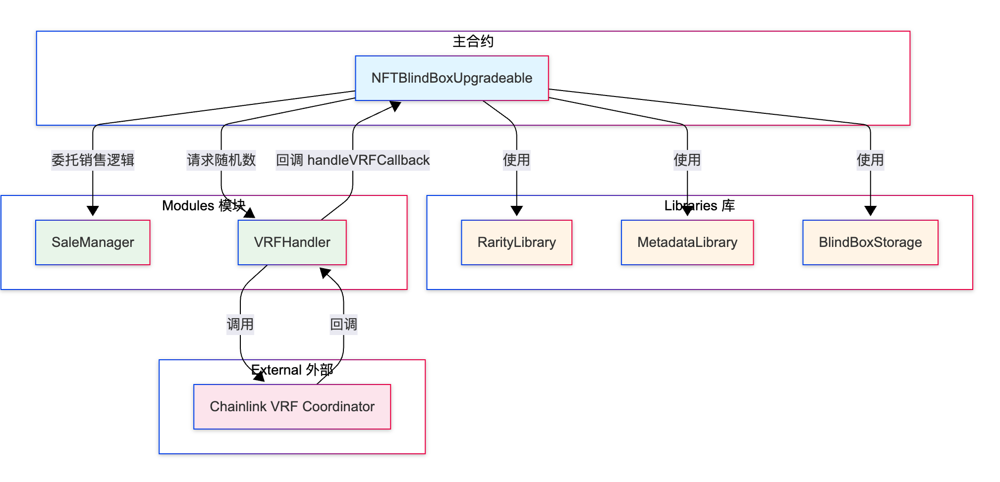
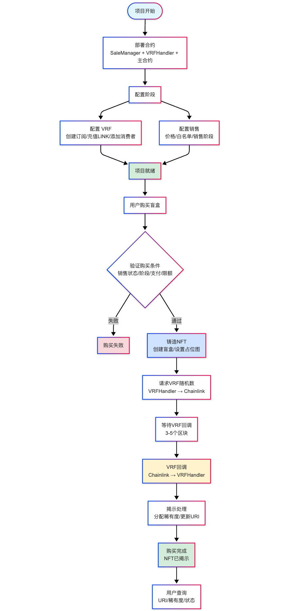
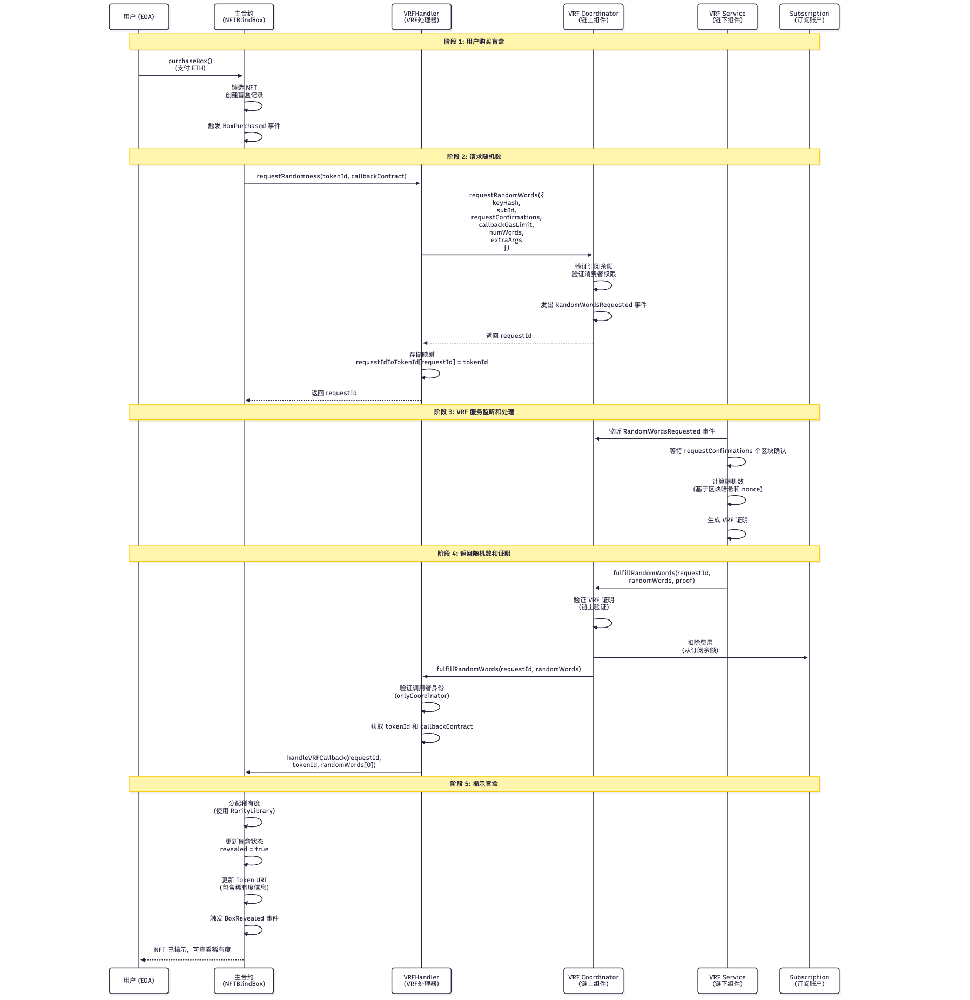
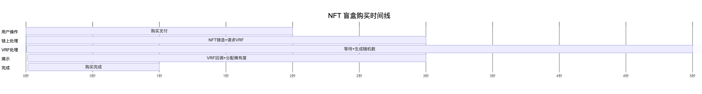
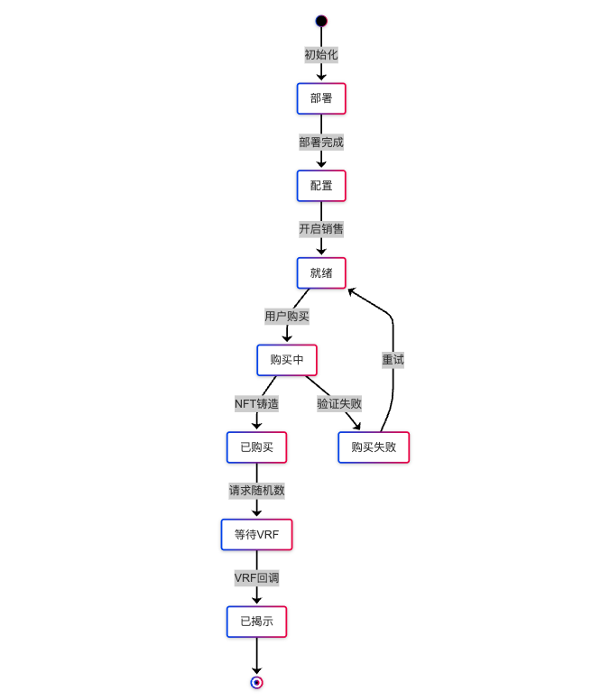

# NFT盲盒项目 (NFT Blind Box)

一个基于 Hardhat 3 开发的NFT盲盒智能合约项目，使用UUPS代理模式支持合约升级，采用模块化设计多合约联动。

## 项目简介

NFT盲盒是一个购买盲盒后随机获得NFT的系统。本项目实现了完整的盲盒功能，包括ERC721标准实现、Chainlink VRF集成、随机数生成、稀有度分配、元数据管理等核心功能。项目采用模块化架构，将功能拆分为多个独立的合约，展示多合约协同工作的设计模式。

## 功能特性

- ERC721标准实现：标准NFT功能，铸造、转账、授权
- Chainlink VRF集成：可验证随机函数，生成真正随机的稀有度
- 随机数生成：基于VRF的随机数生成和稀有度分配
- 盲盒机制：购买盲盒，延迟揭示，稀有度系统
- 元数据管理：IPFS存储，动态元数据，揭示前后状态
- 销售机制：价格设置，总量限制，白名单机制，分阶段销售
- **合约升级**：支持UUPS代理模式的合约升级
- **模块化设计**：多合约联动，职责分离，易于维护和扩展

## 项目结构

```
nft-blindbox/
├── contracts/
│   ├── libraries/
│   │   ├── RarityLibrary.sol          # 稀有度分配逻辑库
│   │   ├── MetadataLibrary.sol        # 元数据URI构建库
│   │   └── BlindBoxStorage.sol        # 盲盒数据结构库
│   ├── modules/
│   │   ├── SaleManager.sol            # 销售管理模块（独立可升级）
│   │   └── BlindBoxStorage.sol        # 盲盒存储库
│   ├── handlers/
│   │   └── VRFHandler.sol             # VRF处理器模块（独立可升级）
│   ├── interfaces/
│   │   ├── IVRFHandler.sol            # VRF处理器接口
│   │   └── IVRFCallback.sol           # VRF回调接口
│   ├── NFTBlindBoxUpgradeable.sol     # 主合约（可升级版本V1）
│   └── NFTBlindBoxV2.sol              # 升级版本（V2）
├── test/
│   └── NFTBlindBox.test.ts            # 测试文件
├── scripts/
│   ├── deployModules.ts               # 部署模块脚本
│   ├── deployWithUUPS.ts              # 使用UUPS代理部署主合约
│   ├── upgrade.ts                     # 升级合约脚本
│   └── prepareUpgrade.ts              # 准备升级（验证）
├── ignition/
│   └── modules/
│       └── DeployNFTBlindBox.ts       # Ignition 部署模块
├── hardhat.config.ts                  # Hardhat 配置
├── package.json                       # 项目依赖
├── tsconfig.json                      # TypeScript 配置
├── README.md                          # 项目说明
├── README_UPGRADE.md                  # 升级指南
├── docs/                              # 详细文档目录
│   ├── DEPLOYMENT.md                  # 部署指南
│   ├── VRF_SETUP.md                   # VRF配置指南
│   ├── SALE.md                        # 销售管理文档
│   ├── UPGRADE.md                     # 升级详细文档
│   └── VRFHandler交互流程分析.md      # VRFHandler交互流程分析
└── images/
    └── contract_img.png               # 合约关系图
```

## 架构设计

### 设计模式

本项目采用多种设计模式实现模块化和代码复用：

1. **Library模式**：纯逻辑库，无状态变量
   - `RarityLibrary.sol` - 稀有度分配逻辑
   - `MetadataLibrary.sol` - 元数据URI构建
   - `BlindBoxStorage.sol` - 盲盒数据结构定义

2. **模块化设计**：独立可升级合约
   - `SaleManager.sol` - 销售管理模块（独立部署）
   - `VRFHandler.sol` - VRF处理器模块（独立部署）

3. **组合模式**：主合约组合所有模块
   - `NFTBlindBoxUpgradeable.sol` - 主合约，整合所有模块

4. **接口模式**：定义标准接口
   - `IVRFHandler.sol` - VRF处理器接口
   - `IVRFCallback.sol` - VRF回调接口

### 合约关系图




### 模块说明

#### 1. RarityLibrary（稀有度库）

**位置**：`contracts/libraries/RarityLibrary.sol`

**功能**：
- 稀有度枚举定义（Common、Rare、Epic、Legendary）
- 根据随机数分配稀有度
- 稀有度转字符串
- 概率验证

**特点**：
- 纯逻辑，无状态变量
- 可安全与可升级合约配合使用
- 使用Library模式，代码内联，节省Gas

**使用示例**：
```solidity
import "./libraries/RarityLibrary.sol";

RarityLibrary.Rarity rarity = RarityLibrary.assignRarity(randomness);
string memory rarityStr = RarityLibrary.rarityToString(rarity);
```

#### 2. MetadataLibrary（元数据库）

**位置**：`contracts/libraries/MetadataLibrary.sol`

**功能**：
- 构建tokenURI
- 构建盲盒URI
- 数值转字符串
- URI拼接

**特点**：
- 纯逻辑库
- 与RarityLibrary配合使用

**使用示例**：
```solidity
import "./libraries/MetadataLibrary.sol";
import "./libraries/RarityLibrary.sol";

string memory uri = MetadataLibrary.buildTokenURI(
    baseURI,
    tokenId,
    RarityLibrary.Rarity.Legendary
);
string memory blindBoxUri = MetadataLibrary.buildBlindBoxURI(baseURI);
```

#### 3. BlindBoxStorage（盲盒存储库）

**位置**：`contracts/modules/BlindBoxStorage.sol`

**功能**：
- 定义BlindBox结构体
- 提供盲盒操作方法

**特点**：
- 定义数据结构
- 提供便利方法

**使用示例**：
```solidity
import "./modules/BlindBoxStorage.sol";

// 创建盲盒
BlindBoxStorage.BlindBox memory box = BlindBoxStorage.createBlindBox();

// 标记为已揭示
BlindBoxStorage.BlindBox storage storedBox = blindBoxes[tokenId];
storedBox.markAsRevealed();

// 获取状态
(bool purchased, bool revealed, uint256 purchaseTime, uint256 revealTime) = 
    storedBox.getStatus();
```

#### 4. SaleManager（销售管理模块）

**位置**：`contracts/modules/SaleManager.sol`

**功能**：
- 销售状态管理
- 价格管理
- 白名单管理
- 购买验证

**部署方式**：独立可升级合约（UUPS）

**主要接口**：
```solidity
function canPurchase(address user, uint256 userBalance, uint256 payment)
    external view returns (bool, string memory);

function recordWhitelistPurchase(address user) external;
function setPrice(uint256 _price) external onlyOwner;
function addToWhitelist(address[] memory addresses) external onlyOwner;
function setSalePhase(SalePhase _phase) external onlyOwner;
// ...
```

**使用示例**：
```typescript
// 检查是否可以购买
const [canBuy, reason] = await saleManager.canPurchase(
  userAddress,
  userBalance,
  payment
);

// 设置价格
await saleManager.setPrice(ethers.parseEther("0.1"));

// 添加白名单
await saleManager.addToWhitelist([
  "0x1234...",
  "0x5678..."
]);

// 设置销售阶段
await saleManager.setSalePhase(2); // Public
```

#### 5. VRFHandler（VRF处理器模块）

**位置**：`contracts/handlers/VRFHandler.sol`

**功能**：
- 请求Chainlink VRF随机数
- 处理VRF回调
- 调用主合约的回调函数

**部署方式**：独立可升级合约（UUPS）

**工作流程**：
1. 主合约调用 `requestRandomness(tokenId, callbackContract)`
2. VRFHandler请求Chainlink VRF
3. Chainlink回调 `fulfillRandomWords`
4. VRFHandler调用主合约的 `handleVRFCallback`

**主要接口**：
```solidity
function requestRandomness(uint256 tokenId, address callbackContract)
    external returns (uint256 requestId);

function fulfillRandomWords(uint256 requestId, uint256[] memory randomWords)
    external;
```

**使用示例**：
```typescript
// 请求随机数（由主合约调用）
const requestId = await vrfHandler.requestRandomness(
  tokenId,
  mainContractAddress
);

// 查询请求对应的tokenId
const tokenIdFromRequest = await vrfHandler.getTokenIdByRequestId(requestId);

// 获取VRF配置
const coordinator = await vrfHandler.getVRFCoordinator();
const keyHash = await vrfHandler.getKeyHash();
const subscriptionId = await vrfHandler.getSubscriptionId();
```

## 文档导航

本项目提供了详细的文档，帮助你快速上手和深入理解：

- **[部署指南](./docs/DEPLOYMENT.md)**：详细的部署步骤，包括环境变量配置、模块部署、主合约部署等
- **[VRF配置指南](./docs/VRF_SETUP.md)**：Chainlink VRF 的完整配置流程，包括订阅创建、消费者添加、问题诊断等
- **[销售管理文档](./docs/SALE.md)**：销售机制的详细说明，包括价格设置、白名单管理、销售阶段控制等
- **[升级详细文档](./docs/UPGRADE.md)**：合约升级的完整流程，包括存储布局规则、升级验证、升级执行等
- **[VRFHandler交互流程分析](./docs/VRFHandler交互流程分析.md)**：VRFHandler 模块的详细技术分析，包括架构设计、交互流程、核心方法等

**建议阅读顺序**：
1. 先阅读本文档了解项目整体架构
2. 按照 [部署指南](./docs/DEPLOYMENT.md) 部署项目
3. 参考 [VRF配置指南](./docs/VRF_SETUP.md) 配置 Chainlink VRF
4. 查看 [销售管理文档](./docs/SALE.md) 了解销售机制
5. 深入学习 [VRFHandler交互流程分析](./docs/VRFHandler交互流程分析.md) 理解技术细节

## 快速开始

### 1. 安装依赖

```bash
npm install
```

### 2. 编译合约

```bash
npm run compile
```

### 3. 运行测试

```bash
npm run test
```

### 4. 部署合约

**📖 详细部署步骤请参阅 [部署指南](./docs/DEPLOYMENT.md)**

#### 步骤1：部署模块

首先部署SaleManager和VRFHandler模块：

```bash
npx hardhat run scripts/deployModules.ts --network sepolia
```

输出示例：
```
SaleManager: 0x5FbDB2315678afecb367f032d93F642f64180aa3
VRFHandler: 0xe7f1725E7734CE288F8367e1Bb143E90bb3F0512
```

#### 步骤2：配置 VRF（重要）

**📖 详细 VRF 配置步骤请参阅 [VRF配置指南](./docs/VRF_SETUP.md)**

在部署主合约前，需要先配置 Chainlink VRF：
1. 创建 VRF 订阅并充值 LINK
2. 将 VRFHandler 地址添加为消费者
3. 在 VRFHandler 合约中更新订阅 ID

#### 步骤3：部署主合约

使用模块地址部署主合约：

```bash
# 设置模块地址
export SALE_MANAGER_ADDRESS=0x5FbDB2315678afecb367f032d93F642f64180aa3
export VRF_HANDLER_ADDRESS=0xe7f1725E7734CE288F8367e1Bb143E90bb3F0512

# 部署主合约
npx hardhat run scripts/deployWithUUPS.ts --network localhost
```

#### 步骤4：配置权限（可选）

如果需要主合约管理模块：

```solidity
// 转移SaleManager的所有权给主合约
saleManager.transferOwnership(mainContractAddress);

// 转移VRFHandler的所有权给主合约
vrfHandler.transferOwnership(mainContractAddress);
```

## 完整业务流程图

### 项目生命周期全流程

以下是 NFT 盲盒项目从初始化到用户购买完成的完整业务流程：



### 阶段详细说明

#### 1. 部署阶段 (Deployment Phase)

**目标**: 将所有智能合约部署到区块链网络

**步骤**:
1. **部署模块合约**
   - `SaleManager`: 销售管理模块，负责价格、白名单、销售阶段管理
   - `VRFHandler`: VRF 处理模块，负责与 Chainlink VRF 交互

2. **配置模块参数**
   - SaleManager: 设置价格、最大供应量、每钱包最大购买数
   - VRFHandler: 配置 VRF Coordinator、Key Hash、Subscription ID

3. **部署主合约**
   - 使用 UUPS 代理模式部署 `NFTBlindBoxUpgradeable`
   - 初始化时传入模块地址和基础配置

**关键输出**:
- SaleManager 合约地址
- VRFHandler 合约地址
- 主合约代理地址
- 实现合约地址

#### 2. 项目配置阶段 (Configuration Phase)

**目标**: 配置项目的销售参数和 VRF 设置

**VRF 配置**:
1. 在 Chainlink VRF 控制台创建订阅
2. 为订阅充值 LINK 代币（建议 5-10 LINK）
3. 将 VRFHandler 地址添加为消费者
4. 在 VRFHandler 合约中更新订阅 ID 和配置

**销售配置**:
1. 设置盲盒价格（ETH）
2. 设置最大供应量
3. 设置每个钱包最大购买数
4. 添加白名单地址（如需要）
5. 设置销售阶段（未开始/白名单/公售）
6. 开启销售

**关键操作**:
```typescript
// 设置价格
await saleManager.setPrice(ethers.parseEther("0.08"));

// 添加白名单
await saleManager.addToWhitelist([address1, address2]);

// 设置销售阶段
await saleManager.setSalePhase(1); // 1 = Whitelist, 2 = Public

// 开启销售
await saleManager.setSaleActive(true);
```

#### 3. 用户操作阶段 (User Interaction Phase)

**用户查询操作**:
- 查询当前价格
- 查询销售阶段和状态
- 查询自己的余额
- 查询是否在白名单
- 查询已购买的盲盒数量

**购买流程验证**:
1. **销售状态检查**: 销售必须处于开启状态
2. **阶段检查**: 
   - 白名单阶段：用户必须在白名单中，且未超过白名单限额
   - 公售阶段：所有用户都可以购买
3. **支付验证**: 用户支付的 ETH 必须 >= 盲盒价格
4. **钱包限额检查**: 用户已购买数量 < 每钱包最大购买数
5. **总供应量检查**: 当前总供应量 < 最大供应量

#### 4. 购买处理阶段 (Purchase Processing Phase)

**执行步骤**:
1. **记录购买**: 在 SaleManager 中记录购买信息
2. **铸造 NFT**: 使用 `_safeMint()` 铸造新的 NFT Token
3. **创建盲盒**: 创建 BlindBox 数据结构
   - `purchased = true`
   - `revealed = false`
   - `purchaseTime = block.timestamp`
   - `rarity = 0` (未分配)
4. **设置盲盒 URI**: 使用 `MetadataLibrary.buildBlindBoxURI()` 设置占位图
5. **触发事件**: 触发 `BoxPurchased` 事件

**此时状态**:
- NFT 已铸造，用户拥有该 Token
- Token URI 显示盲盒占位图（未揭示状态）
- 稀有度尚未分配

#### 5. VRF 请求阶段 (VRF Request Phase)

**执行步骤**:
1. **调用 VRFHandler**: 主合约调用 `VRFHandler.requestRandomness(tokenId, mainContractAddress)`
2. **VRFHandler 处理**:
   - 调用 Chainlink VRF Coordinator 的 `requestRandomWords()`
   - 传入 Key Hash、Subscription ID、确认数、Gas Limit
3. **存储映射**: 
   - `requestIdToTokenId[requestId] = tokenId`
   - `requestIdToCallback[requestId] = callbackContract`
4. **触发事件**: 触发 `RandomnessRequested` 事件

**等待时间**:
- 通常需要 3-5 个区块确认（取决于 `requestConfirmations` 设置）
- 链上生成随机数需要一些时间

#### 6. VRF 回调阶段 (VRF Callback Phase)

**执行步骤**:
1. **Chainlink 回调**: Chainlink VRF Coordinator 调用 `VRFHandler.fulfillRandomWords()`
2. **身份验证**: 验证调用者是否为 VRF Coordinator（`onlyCoordinator` 修饰符）
3. **获取信息**: 从映射中获取 `tokenId` 和 `callbackContract`
4. **触发事件**: 触发 `RandomnessFulfilled` 事件
5. **调用主合约**: 调用主合约的 `handleVRFCallback(requestId, tokenId, randomWords[0])`

### Chainlink VRF v2.5 完整流程图

根据 [Chainlink VRF v2.5 官方文档](https://docs.chain.link/vrf/v2-5/overview/subscription)，以下是完整的 VRF 请求和接收数据流程：



**流程详细说明：**

1. **用户购买阶段**：
   - 用户（EOA）调用主合约的 `purchaseBox()` 函数
   - 主合约验证购买条件（销售状态、价格、余额等）
   - 主合约铸造 NFT 并创建盲盒记录（状态为未揭示）

2. **VRF 请求阶段**：
   - 主合约调用 `VRFHandler.requestRandomness()` 请求随机数
   - VRFHandler 构建 VRF v2.5 请求结构体，包含：
     - `keyHash`: 标识 gas lane（gas 价格上限）
     - `subId`: 订阅 ID（256 位整数）
     - `requestConfirmations`: 区块确认数（通常为 3）
     - `callbackGasLimit`: 回调函数 gas 限制
     - `numWords`: 请求的随机数数量
     - `extraArgs`: 额外参数（如 `nativePayment`）
   - VRFHandler 调用 VRF Coordinator 的 `requestRandomWords()`
   - VRF Coordinator 验证订阅余额和消费者权限
   - VRF Coordinator 发出 `RandomWordsRequested` 事件并返回 `requestId`

3. **VRF 服务处理阶段**（链下）：
   - VRF Service（链下组件）监听 VRF Coordinator 的事件
   - 等待指定的区块确认数（`requestConfirmations`）
   - 基于区块哈希和 nonce 计算随机数
   - 生成可验证的随机函数证明（VRF Proof）

4. **随机数返回阶段**：
   - VRF Service 发送交易到 VRF Coordinator，包含随机数和证明
   - VRF Coordinator 在链上验证 VRF 证明
   - 验证通过后，从订阅账户扣除费用（LINK 或原生代币）
   - VRF Coordinator 调用 VRFHandler 的 `fulfillRandomWords()`

5. **回调处理阶段**：
   - VRFHandler 验证调用者身份（必须是 VRF Coordinator）
   - 从映射中获取对应的 `tokenId` 和 `callbackContract`
   - 调用主合约的 `handleVRFCallback()` 函数

6. **盲盒揭示阶段**：
   - 主合约接收随机数
   - 使用 `RarityLibrary.assignRarity()` 根据随机数分配稀有度
   - 更新盲盒状态：`revealed = true`，存储稀有度
   - 使用 `MetadataLibrary.buildTokenURI()` 构建包含稀有度的最终 URI
   - 触发 `BoxRevealed` 和 `RarityAssigned` 事件

**关键概念说明：**

- **Gas Lane (keyHash)**: 标识不同的 gas 价格上限。选择较低的 gas lane 可以降低费用，但可能在网络拥堵时延迟处理
- **Subscription Account**: 预付费账户，持有 LINK 或原生代币，用于支付 VRF 请求费用
- **Request Confirmations**: VRF 服务等待的区块确认数，确保随机数基于稳定的区块数据
- **Callback Gas Limit**: 回调函数的最大 gas 限制，必须足够执行 `fulfillRandomWords()` 中的逻辑
- **VRF Proof**: 可验证的证明，证明随机数是基于区块数据生成的，无法被预测或操纵

#### 7. 揭示处理阶段 (Reveal Processing Phase)

**执行步骤**:
1. **分配稀有度**: 使用 `RarityLibrary.assignRarity(randomness)` 根据随机数分配稀有度
   - 随机数范围: 0-9999
   - Common (0-5999): 60%
   - Rare (6000-8499): 25%
   - Epic (8500-9699): 12%
   - Legendary (9700-9999): 3%
2. **存储稀有度**: 将稀有度存储到盲盒数据结构中
3. **构建 Token URI**: 使用 `MetadataLibrary.buildTokenURI()` 构建包含稀有度的最终 URI
4. **更新状态**: 
   - `revealed = true`
   - `revealTime = block.timestamp`
   - `rarity = assignedRarity`
5. **触发事件**: 
   - 触发 `BoxRevealed` 事件
   - 触发 `RarityAssigned` 事件
6. **清理映射**: 删除 `requestIdToTokenId` 和 `requestIdToCallback` 中的映射

**此时状态**:
- NFT 已揭示，Token URI 显示最终元数据
- 稀有度已确定并存储
- 用户可以查询完整的 NFT 信息

#### 8. 查询阶段 (Query Phase)

**可查询信息**:
1. **Token URI**: 查询最终的 NFT 元数据 URI
2. **稀有度**: 查询 NFT 的稀有度等级
3. **盲盒状态**: 查询是否已购买、是否已揭示
4. **所有者**: 查询 NFT 的当前所有者
5. **购买时间**: 查询购买时间戳
6. **揭示时间**: 查询揭示时间戳

**查询示例**:
```typescript
// 查询盲盒状态
const [purchased, revealed, rarity] = await blindBox.getBlindBoxStatus(tokenId);

// 查询稀有度
const rarity = await blindBox.getRarity(tokenId);

// 查询 Token URI
const tokenURI = await blindBox.tokenURI(tokenId);
```

### 关键时间节点



### 状态转换图



### 数据流图


## 使用说明

### 部署配置

部署时需要配置以下参数：

- **NFT信息**：名称、符号、最大供应量
- **模块地址**：SaleManager地址、VRFHandler地址
- **元数据**：baseURI（IPFS地址）

**注意**：VRF配置需要在VRFHandler模块中设置。

### 购买盲盒

```typescript
await blindBox.purchaseBox({ value: price });
```

### 查询盲盒状态

```typescript
const [purchased, revealed, rarity] = await blindBox.getBlindBoxStatus(tokenId);
```

### 查询稀有度

```typescript
const rarity = await blindBox.getRarity(tokenId);
```

### 查询销售信息

```typescript
const [active, phase, price, maxWallet] = await blindBox.getSaleInfo();
```

## 使用示例

### 完整购买流程示例

```typescript
import { ethers } from "hardhat";
import { network } from "hardhat";

async function purchaseBlindBox() {
  const { ethers } = await network.connect();
  const [deployer, buyer] = await ethers.getSigners();
  
  // 获取合约实例
  const blindBox = await ethers.getContractAt(
    "NFTBlindBoxUpgradeable",
    "0x...你的代理地址..."
  );
  
  // 1. 查询当前价格
  const price = await blindBox.price();
  console.log("盲盒价格:", ethers.formatEther(price), "ETH");
  
  // 2. 查询销售状态
  const [active, phase] = await blindBox.getSaleInfo();
  console.log("销售状态:", active ? "进行中" : "未开始");
  console.log("销售阶段:", phase === 0 ? "未开始" : phase === 1 ? "白名单" : "公售");
  
  // 3. 购买盲盒
  console.log("购买盲盒中...");
  const tx = await blindBox.connect(buyer).purchaseBox({
    value: price
  });
  const receipt = await tx.wait();
  
  // 4. 获取购买的tokenId（从事件中）
  const purchaseEvent = receipt.logs.find(
    log => {
      try {
        const parsed = blindBox.interface.parseLog(log);
        return parsed.name === "BoxPurchased";
      } catch {
        return false;
      }
    }
  );
  
  if (purchaseEvent) {
    const parsed = blindBox.interface.parseLog(purchaseEvent);
    const tokenId = parsed.args.tokenId;
    console.log("购买的盲盒tokenId:", tokenId.toString());
    
    // 5. 查询盲盒状态（初始状态为未揭示）
    const [purchased, revealed, rarity] = await blindBox.getBlindBoxStatus(tokenId);
    console.log("已购买:", purchased);
    console.log("已揭示:", revealed);
    console.log("稀有度:", rarity === 0 ? "Common" : rarity === 1 ? "Rare" : rarity === 2 ? "Epic" : "Legendary");
    
    // 6. 等待VRF回调（揭示盲盒）
    console.log("等待VRF回调揭示盲盒...");
    // 注意：实际应用中需要监听事件或轮询状态
  }
}
```

### 销售管理示例

```typescript
async function manageSale() {
  const { ethers } = await network.connect();
  const [owner] = await ethers.getSigners();
  
  const blindBox = await ethers.getContractAt(
    "NFTBlindBoxUpgradeable",
    "0x...你的代理地址..."
  );
  
  // 1. 设置价格
  const newPrice = ethers.parseEther("0.1");
  await blindBox.connect(owner).setPrice(newPrice);
  console.log("价格已更新为:", ethers.formatEther(newPrice), "ETH");
  
  // 2. 添加白名单
  const whitelistAddresses = [
    "0x1234567890123456789012345678901234567890",
    "0x0987654321098765432109876543210987654321"
  ];
  await blindBox.connect(owner).addToWhitelist(whitelistAddresses);
  console.log("白名单已添加");
  
  // 3. 设置销售阶段为白名单阶段
  await blindBox.connect(owner).setSalePhase(1); // 1 = Whitelist
  console.log("销售阶段已设置为白名单阶段");
  
  // 4. 开启公售
  await blindBox.connect(owner).setSalePhase(2); // 2 = Public
  console.log("销售阶段已设置为公售");
}
```

### 查询示例

```typescript
async function queryExamples() {
  const { ethers } = await network.connect();
  
  const blindBox = await ethers.getContractAt(
    "NFTBlindBoxUpgradeable",
    "0x...你的代理地址..."
  );
  
  // 1. 查询NFT基本信息
  const name = await blindBox.name();
  const symbol = await blindBox.symbol();
  const totalSupply = await blindBox.totalSupply();
  const maxSupply = await blindBox.maxSupply();
  
  console.log("名称:", name);
  console.log("符号:", symbol);
  console.log("当前供应量:", totalSupply.toString());
  console.log("最大供应量:", maxSupply.toString());
  
  // 2. 查询特定token的信息
  const tokenId = 0n;
  const owner = await blindBox.ownerOf(tokenId);
  const tokenURI = await blindBox.tokenURI(tokenId);
  const rarity = await blindBox.getRarity(tokenId);
  const [purchased, revealed] = await blindBox.getBlindBoxStatus(tokenId);
  
  console.log("Token ID:", tokenId.toString());
  console.log("所有者:", owner);
  console.log("Token URI:", tokenURI);
  console.log("稀有度:", rarity);
  console.log("已购买:", purchased);
  console.log("已揭示:", revealed);
  
  // 3. 查询销售信息
  const [active, phase, price, maxWallet] = await blindBox.getSaleInfo();
  console.log("销售状态:", active);
  console.log("销售阶段:", phase.toString());
  console.log("价格:", ethers.formatEther(price), "ETH");
  console.log("每个钱包最大购买数:", maxWallet.toString());
}
```

### 事件监听示例

```typescript
async function listenToEvents() {
  const { ethers } = await network.connect();
  
  const blindBox = await ethers.getContractAt(
    "NFTBlindBoxUpgradeable",
    "0x...你的代理地址..."
  );
  
  // 监听购买事件
  blindBox.on("BoxPurchased", (buyer, tokenId, event) => {
    console.log("盲盒已购买:");
    console.log("  购买者:", buyer);
    console.log("  Token ID:", tokenId.toString());
    console.log("  区块号:", event.blockNumber);
  });
  
  // 监听揭示事件
  blindBox.on("BoxRevealed", (tokenId, rarity, event) => {
    console.log("盲盒已揭示:");
    console.log("  Token ID:", tokenId.toString());
    console.log("  稀有度:", rarity);
    console.log("  区块号:", event.blockNumber);
  });
  
  // 监听稀有度分配事件
  blindBox.on("RarityAssigned", (tokenId, rarity, event) => {
    console.log("稀有度已分配:");
    console.log("  Token ID:", tokenId.toString());
    console.log("  稀有度:", rarity);
  });
}
```

### 模块交互示例

```typescript
async function moduleInteraction() {
  const { ethers } = await network.connect();
  
  const blindBox = await ethers.getContractAt(
    "NFTBlindBoxUpgradeable",
    "0x...你的代理地址..."
  );
  
  // 获取模块地址
  const saleManagerAddress = await blindBox.saleManager();
  const vrfHandlerAddress = await blindBox.vrfHandler();
  
  console.log("SaleManager地址:", saleManagerAddress);
  console.log("VRFHandler地址:", vrfHandlerAddress);
  
  // 直接与SaleManager交互
  const SaleManager = await ethers.getContractFactory("SaleManager");
  const saleManager = SaleManager.attach(saleManagerAddress);
  
  const price = await saleManager.price();
  const saleActive = await saleManager.saleActive();
  const currentPhase = await saleManager.currentPhase();
  
  console.log("SaleManager价格:", ethers.formatEther(price), "ETH");
  console.log("SaleManager销售状态:", saleActive);
  console.log("SaleManager销售阶段:", currentPhase.toString());
  
  // 检查用户是否可以购买
  const userAddress = "0x...用户地址...";
  const userBalance = await blindBox.balanceOf(userAddress);
  const payment = ethers.parseEther("0.1");
  
  const [canBuy, reason] = await saleManager.canPurchase(
    userAddress,
    userBalance,
    payment
  );
  
  if (canBuy) {
    console.log("用户可以购买");
  } else {
    console.log("用户不能购买，原因:", reason);
  }
}
```

## 技术栈 

- **Solidity**: 0.8.24
- **Hardhat**: 3.0.0
- **Hardhat Ignition**: 3.0.0
- **OpenZeppelin Contracts**: 5.0.0 (upgradeable)
- **Chainlink Contracts**: 1.1.0
- **OpenZeppelin Upgrades**: 3.0.0
- **TypeScript**: Latest
- **Ethers.js**: v6 (via Hardhat Toolbox)

## 稀有度分配

本项目使用以下概率分布：

- **Common (普通)**: 60%
- **Rare (稀有)**: 25%
- **Epic (史诗)**: 12%
- **Legendary (传说)**: 3%

概率配置在 `RarityLibrary.sol` 中定义，可以根据需要进行调整。

## 合约升级

### 准备升级（验证）

```bash
PROXY_ADDRESS=0x... npm run prepare:upgrade
```

### 执行升级

```bash
PROXY_ADDRESS=0x... npm run upgrade
```

详细升级指南请参阅：
- [README_UPGRADE.md](./README_UPGRADE.md) - 快速升级指南
- [docs/UPGRADE.md](./docs/UPGRADE.md) - 详细升级文档

### UUPS模式特点

- 升级逻辑在实现合约中
- 不需要单独的ProxyAdmin合约
- 更节省Gas
- 升级权限由实现合约的owner控制

### 存储布局规则

升级时必须遵循存储布局规则：
- 可以添加新的状态变量（在末尾）
-  不能删除状态变量
-  不能改变变量类型
-  不能改变变量顺序

## 模块化架构优势

### 1. 模块化
- 每个模块职责单一，易于理解和维护
- 可以独立测试每个模块
- 可以独立升级模块

### 2. 代码复用
- Library可以在多个合约中复用
- 模块可以被其他项目复用

### 3. Gas优化
- Library代码内联，不增加部署成本
- 模块可以独立部署，避免单个合约过大

### 4. 可升级性
- 主合约和模块都支持UUPS升级
- 可以单独升级某个模块，不影响其他部分

### 5. 安全性
- 权限控制清晰（每个模块有自己的owner）
- 接口定义明确，减少集成错误

## 安全考虑

本项目实现了以下安全措施：

1. **随机数安全**：使用Chainlink VRF确保可验证的随机性
2. **重入攻击防护**：使用ReentrancyGuard
3. **权限控制**：onlyOwner修饰符限制管理员操作
4. **输入验证**：验证所有输入参数
5. **升级安全**：UUPS模式确保升级权限安全
6. **使用最新Solidity版本**：利用内置安全检查
7. **接口验证**：使用接口定义明确的合约交互

## 注意事项

1. **模块依赖**：主合约依赖SaleManager和VRFHandler，必须先部署模块
2. **权限管理**：模块有自己的owner，需要正确设置权限
3. **存储布局**：升级时注意存储布局兼容性
4. **接口实现**：主合约必须实现IVRFCallback接口
5. **VRF配置**：需要在VRFHandler中配置正确的Chainlink VRF参数
6. **回调验证**：VRFHandler会验证回调调用者的身份

## 扩展建议

1. **添加新模块**：可以创建新的模块合约，如 `AuctionManager`（拍卖管理）
2. **模块版本化**：可以为模块创建V2版本，支持功能升级
3. **事件监听**：前端可以监听各个模块的事件，实现更丰富的功能
4. **跨合约查询**：可以创建查询合约，聚合多个模块的数据
5. **访问控制**：可以实现更细粒度的权限控制机制

## 许可证

MIT License

## 参考资源

- [OpenZeppelin Upgrades 文档](https://docs.openzeppelin.com/upgrades-plugins/1.x/)
- [Chainlink VRF 文档](https://docs.chain.link/vrf/v2/introduction)
- [Hardhat Ignition 文档](https://hardhat.org/ignition/docs)
- [ERC721标准](https://eips.ethereum.org/EIPS/eip-721)
- [UUPS代理模式](https://docs.openzeppelin.com/upgrades-plugins/1.x/proxies#uups-proxies)

## 贡献

欢迎提交 Issue 和 Pull Request！
