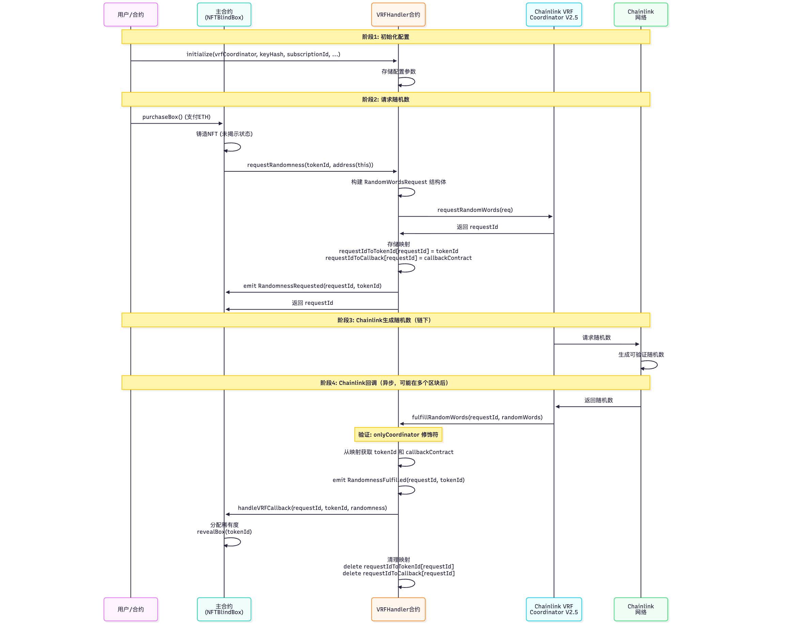

# VRFHandler 与 Chainlink VRF 交互流程分析

## 一、整体架构

VRFHandler 合约作为 Chainlink VRF 的中介层，将 VRF 功能封装成独立模块，供其他合约（如 NFTBlindBoxUpgradeable）使用。

### 核心组件

1. **VRFHandler**: 可升级的 VRF 处理器合约
2. **Chainlink VRF Coordinator V2.5**: Chainlink 的 VRF 协调器合约
3. **主合约（如 NFTBlindBoxUpgradeable）**: 实现 `IVRFCallback` 接口，接收随机数回调

### 关键状态变量

```88:110:nft-blindbox/contracts/handlers/VRFHandler.sol
    function requestRandomness(uint256 tokenId, address callbackContract)
        external
        override
        returns (uint256 requestId)
    {
        // 构建 VRF v2.5 请求结构体
        VRFV2PlusClient.RandomWordsRequest memory req = VRFV2PlusClient.RandomWordsRequest({
            keyHash: keyHash,
            subId: subscriptionId,
            requestConfirmations: requestConfirmations,
            callbackGasLimit: callbackGasLimit,
            numWords: numWords,
            extraArgs: VRFV2PlusClient._argsToBytes(
                VRFV2PlusClient.ExtraArgsV1({nativePayment: nativePayment})
            )
        });

        requestId = vrfCoordinator.requestRandomWords(req);
        requestIdToTokenId[requestId] = tokenId;
        requestIdToCallback[requestId] = callbackContract;

        emit RandomnessRequested(requestId, tokenId);
    }
```

- `vrfCoordinator`: Chainlink VRF Coordinator 合约地址
- `subscriptionId`: VRF 订阅 ID（用于支付 Gas 费用）
- `requestIdToTokenId`: 请求ID到tokenId的映射
- `requestIdToCallback`: 请求ID到回调合约地址的映射

## 二、完整交互流程图



## 三、核心方法详解

### 1. initialize - 初始化配置

```63:79:nft-blindbox/contracts/handlers/VRFHandler.sol
    function initialize(
        address _vrfCoordinator,
        bytes32 _keyHash,
        uint256 _subscriptionId, // VRF v2.5 使用 uint256
        uint32 _callbackGasLimit,
        uint16 _requestConfirmations,
        bool _nativePayment // VRF v2.5 支持原生代币支付
    ) public initializer {
        __Ownable_init(msg.sender);
        vrfCoordinator = IVRFCoordinatorV2Plus(_vrfCoordinator);
        keyHash = _keyHash;
        subscriptionId = _subscriptionId;
        callbackGasLimit = _callbackGasLimit;
        requestConfirmations = _requestConfirmations;
        numWords = 1;
        nativePayment = _nativePayment;
    }
```

**作用**: 初始化 VRF 配置参数

**参数说明**:
- `_vrfCoordinator`: Chainlink VRF Coordinator V2.5 合约地址
- `_keyHash`: 对应不同Gas价格的密钥哈希值
- `_subscriptionId`: VRF订阅ID，用于支付Gas费用
- `_callbackGasLimit`: 回调函数的最大Gas限制
- `_requestConfirmations`: 请求确认数（通常为3）
- `_nativePayment`: 是否使用原生代币（ETH）支付，VRF v2.5特性

**调用时机**: 合约部署后首次初始化

### 2. requestRandomness - 请求随机数

```88:110:nft-blindbox/contracts/handlers/VRFHandler.sol
    function requestRandomness(uint256 tokenId, address callbackContract)
        external
        override
        returns (uint256 requestId)
    {
        // 构建 VRF v2.5 请求结构体
        VRFV2PlusClient.RandomWordsRequest memory req = VRFV2PlusClient.RandomWordsRequest({
            keyHash: keyHash,
            subId: subscriptionId,
            requestConfirmations: requestConfirmations,
            callbackGasLimit: callbackGasLimit,
            numWords: numWords,
            extraArgs: VRFV2PlusClient._argsToBytes(
                VRFV2PlusClient.ExtraArgsV1({nativePayment: nativePayment})
            )
        });

        requestId = vrfCoordinator.requestRandomWords(req);
        requestIdToTokenId[requestId] = tokenId;
        requestIdToCallback[requestId] = callbackContract;

        emit RandomnessRequested(requestId, tokenId);
    }
```

**作用**: 向 Chainlink VRF Coordinator 请求随机数

**调用流程**:
1. 构建 `RandomWordsRequest` 结构体，包含所有必要参数
2. 调用 `vrfCoordinator.requestRandomWords(req)` 发起请求
3. 存储请求ID与tokenId、回调合约地址的映射关系
4. 触发 `RandomnessRequested` 事件

**关键点**:
- 使用 VRF v2.5 的新API（`VRFV2PlusClient`）
- 支持原生代币支付（通过 `extraArgs` 传递）
- 请求是异步的，不会立即返回随机数

**调用者**: 主合约（如 NFTBlindBoxUpgradeable）

### 3. fulfillRandomWords - VRF回调函数

```117:140:nft-blindbox/contracts/handlers/VRFHandler.sol
    function fulfillRandomWords(
        uint256 requestId,
        uint256[] memory randomWords
    ) external override onlyCoordinator {
        uint256 tokenId = requestIdToTokenId[requestId];
        address callbackContract = requestIdToCallback[requestId];
        
        if (tokenId == 0 || callbackContract == address(0)) {
            revert InvalidRequestId();
        }

        emit RandomnessFulfilled(requestId, tokenId);

        // 调用回调合约
        IVRFCallback(callbackContract).handleVRFCallback(
            requestId,
            tokenId,
            randomWords[0]
        );

        // 清理映射
        delete requestIdToTokenId[requestId];
        delete requestIdToCallback[requestId];
    }
```

**作用**: 接收 Chainlink VRF Coordinator 返回的随机数，并转发给主合约

**安全机制**:
- `onlyCoordinator` 修饰符确保只有 VRF Coordinator 可以调用
- 验证请求ID对应的tokenId和回调合约地址是否存在

**执行流程**:
1. 验证调用者是否为 VRF Coordinator
2. 从映射中获取对应的 tokenId 和回调合约地址
3. 触发 `RandomnessFulfilled` 事件
4. 调用主合约的 `handleVRFCallback` 方法传递随机数
5. 清理映射数据以节省Gas

**调用时机**: Chainlink VRF Coordinator 异步调用（可能在请求后的1-3个区块）

### 4. updateVRFConfig - 更新配置

```174:190:nft-blindbox/contracts/handlers/VRFHandler.sol
    function updateVRFConfig(
        address _vrfCoordinator,
        bytes32 _keyHash,
        uint256 _subscriptionId, // VRF v2.5 使用 uint256
        uint32 _callbackGasLimit,
        uint16 _requestConfirmations,
        bool _nativePayment // VRF v2.5 支持原生代币支付
    ) external onlyOwner {
        vrfCoordinator = IVRFCoordinatorV2Plus(_vrfCoordinator);
        keyHash = _keyHash;
        subscriptionId = _subscriptionId;
        callbackGasLimit = _callbackGasLimit;
        requestConfirmations = _requestConfirmations;
        nativePayment = _nativePayment;

        emit VRFConfigUpdated(_vrfCoordinator, _keyHash, _subscriptionId);
    }
```

**作用**: 允许合约所有者更新 VRF 配置

**权限**: 仅所有者可调用（`onlyOwner`）

**使用场景**: 
- 切换不同的Gas价格层级（通过keyHash）
- 更新订阅ID
- 调整Gas限制或确认数

## 四、与主合约的集成

主合约（NFTBlindBoxUpgradeable）使用 VRFHandler 的典型流程：

### 1. 购买盲盒并请求随机数

```127:155:nft-blindbox/contracts/NFTBlindBoxUpgradeable.sol
    function purchaseBox() external payable virtual nonReentrant {
        // 使用SaleManager检查购买条件
        uint256 userBalance = balanceOf(msg.sender);
        (bool canBuy, string memory reason) = saleManager.canPurchase(
            msg.sender,
            userBalance,
            msg.value
        );
        require(canBuy, reason);

        require(totalSupply < maxSupply, "Sold out");

        // 记录白名单购买
        saleManager.recordWhitelistPurchase(msg.sender);

        uint256 tokenId = totalSupply;
        totalSupply++;

        // 铸造NFT（未揭示状态）
        _safeMint(msg.sender, tokenId);

        // 设置盲盒状态（使用存储库）
        blindBoxes[tokenId] = BlindBoxStorage.createBlindBox();

        // 使用VRFHandler请求随机数（传入当前合约地址作为回调）
        vrfHandler.requestRandomness(tokenId, address(this));

        emit BoxPurchased(msg.sender, tokenId);
    }
```

### 2. 接收随机数回调

```164:182:nft-blindbox/contracts/NFTBlindBoxUpgradeable.sol
    function handleVRFCallback(
        uint256, // requestId - 保留用于接口兼容性，实际未使用
        uint256 tokenId,
        uint256 randomness
    ) external virtual override {
        // 验证调用者（只验证调用者，revealBox 中会验证 token 存在，避免重复检查）
        require(
            msg.sender == address(vrfHandler),
            "Only VRF handler can call"
        );

        // 使用RarityLibrary分配稀有度
        RarityLibrary.Rarity rarity = RarityLibrary.assignRarity(randomness);
        tokenRarity[tokenId] = rarity;
        emit RarityAssigned(tokenId, rarity);

        // 揭示盲盒（内部函数会验证 token 存在）
        revealBox(tokenId);
    }
```

## 五、关键设计特点

### 1. 模块化设计
- VRFHandler 是独立模块，可被多个合约复用
- 通过接口（IVRFHandler、IVRFCallback）实现解耦

### 2. 可升级性
- 使用 OpenZeppelin 的 UUPS 升级模式
- 允许在不影响主合约的情况下升级 VRF 处理逻辑

### 3. 安全性
- 使用 `onlyCoordinator` 修饰符防止未授权调用
- 回调函数中验证调用者身份
- 使用映射存储请求关系，支持查询

### 4. Gas优化
- 回调完成后立即清理映射数据
- 使用库函数处理复杂逻辑

### 5. VRF v2.5 新特性
- 支持原生代币（ETH）支付，无需 LINK 代币
- 使用 `uint256` 类型的订阅ID
- 通过 `extraArgs` 传递额外参数

## 六、查询函数

```147:215:nft-blindbox/contracts/handlers/VRFHandler.sol
    function getTokenIdByRequestId(uint256 requestId)
        external
        view
        override
        returns (uint256)
    {
        return requestIdToTokenId[requestId];
    }

    /**
     * @dev 获取请求对应的回调合约
     * @param requestId 请求ID
     * @return callbackContract 回调合约地址
     */
    function getCallbackContractByRequestId(uint256 requestId)
        external
        view
        override
        returns (address)
    {
        return requestIdToCallback[requestId];
    }

    // ============ 配置管理 ============
    /**
     * @dev 更新VRF配置（VRF v2.5）
     */
    function updateVRFConfig(
        address _vrfCoordinator,
        bytes32 _keyHash,
        uint256 _subscriptionId, // VRF v2.5 使用 uint256
        uint32 _callbackGasLimit,
        uint16 _requestConfirmations,
        bool _nativePayment // VRF v2.5 支持原生代币支付
    ) external onlyOwner {
        vrfCoordinator = IVRFCoordinatorV2Plus(_vrfCoordinator);
        keyHash = _keyHash;
        subscriptionId = _subscriptionId;
        callbackGasLimit = _callbackGasLimit;
        requestConfirmations = _requestConfirmations;
        nativePayment = _nativePayment;

        emit VRFConfigUpdated(_vrfCoordinator, _keyHash, _subscriptionId);
    }

    // ============ 查询函数 ============
    function getVRFCoordinator() external view returns (address) {
        return address(vrfCoordinator);
    }

    function getKeyHash() external view returns (bytes32) {
        return keyHash;
    }

    function getSubscriptionId() external view returns (uint256) {
        return subscriptionId;
    }

    function getNativePayment() external view returns (bool) {
        return nativePayment;
    }

    function getCallbackGasLimit() external view returns (uint32) {
        return callbackGasLimit;
    }

    function getRequestConfirmations() external view returns (uint16) {
        return requestConfirmations;
    }
```

这些查询函数允许外部合约或前端查询当前的 VRF 配置和请求状态。

## 七、事件

- `RandomnessRequested(uint256 indexed requestId, uint256 indexed tokenId)`: 当发起随机数请求时触发
- `RandomnessFulfilled(uint256 indexed requestId, uint256 indexed tokenId)`: 当随机数返回时触发
- `VRFConfigUpdated(address indexed coordinator, bytes32 keyHash, uint256 subscriptionId)`: 当配置更新时触发

这些事件可用于前端监控和链下追踪随机数请求状态。

